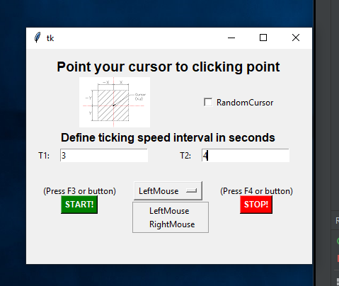

# Clicker
MouseClicker with random cursor location and delay times
 
## GUI of application

Just follow the suggestions from app:

  
- Point cursor, select if You want your clicker to click in area, or in exact point.

- Then enter time delay range. Example :2s and 3s, will click each 2.000000 (random float in between the range You specify)

- Select button to click from dropdown menu.

- Press start or F3 to start, stop or F4 to stop.

